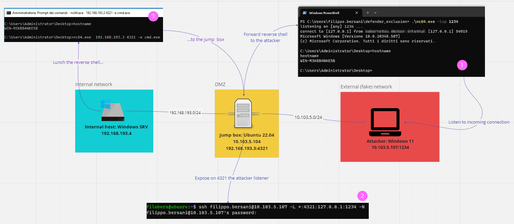

# SSH port forward pivoting for Dummies

## Why?
Because I've always found it hard to understand how SSH forwarding works (and still it's so 😃), especially playing with ports, so I decide to illustrate three simple scenarios, that involve four use cases, to clarify the concepts. Actually they are taken from real engagment, except the second scenario. Here I assume that we have already compromised a dual homed machine, from our attacker machine, located in the external network. The compromised machine acts as a jump-box to the internal network, where the final victim is located. Follows the involved systems specifications:
1. Attacker machine: Windows 11*, located in the externale (fake) net: 10.103.5.107/24
1. Jump-box: Ubuntu server 22.04**, dual homed (internal and external net): 10.103.5.104/24, 192.168.193.3/24
1. The final victim: Windows server STD 2022, located in the internal net: 192.168.193.4/24

<i>* You must enable OpenSSH server: https://learn.microsoft.com/en-us/windows-server/administration/openssh/openssh_install_firstuse?tabs=gui

** The firewall must be disabled, eventually you have to configure inbound rules, in the scenarios when we use local port forwarding (-L), to permitt access to the local (jump-box) exposed port.</i>

Now, let's proceed to analyze them in details.

## Scenario #1: get a reverse shell
### 1.1 Expose the attacker web server to the victim
In order to accomplish our mission, first we need to expose our web server to the victim, to make available netcat. Of course we need to lure the victim to download and then execute netcat, here we must make use of some social engineering techniques, that is out of the scope of this tutorial.
Since the victim cannot directly accesso our web server we need to make it available through the jump-box, that we have already compromised. The steps to follows are:

1. On our attacker machine lunch the web server, listening on port 8000
2. On the jump-box expose the attacker web server on port 8080. Here we will use ssh local forwarding (-L) in the following format: 

        [all available local*** interfaces]:[local port]:[attacker localhost]:[attacker web server port]
    <i>*** local here refers to the jump-box</i>

3. The victim can visit the attacker web server through the jump-box

Follows the work flow:

### 1.2 Get a reverse shell from the victim
Even in this step we are going to use local forwarding to expose the attacker netcat listener to the victim, through the jump-box. Then the victim will execute a reverse shell towards the jump-box, it will be redirected to the attacker machine. The steps are:

1. On the attacker machine we execute the netcat listener on port 1234
2. On the jump-box, as explained before, we need to expose the attacker listener locally, again is intended to the jump-box, on port 4321:

         [all available local interfaces]:[local port]:[attacker localhost]:[attacker listener port]
3. The victim lunches a reverse shell, using netcat, towards the jump-box, that will forward the connection to the attacker machine.

Follows the workflow:

## Scenario #2: access the secret intranet on the victim
This is a dummy scenario, since of course we could directly access, e.g. with curl, to the victim exposed web site (the intranet), but for learning purpose we will proceed to access the intranet through the jump-box. Here we will use the remote port forwarding (-R) to make available on the attacker (server) the victim intranet web site, through the jump-box (client). 

Follows the workflow:
 

1. On the internal net the intranet is available at http://192.168.193.4:8080 
2. On the victim machine the firewall ACL allow access only to the internal network
3. On the jump-box we must forward the request to the attacker localhost:9000 to the remote victim intranet:

         <attacker port>:<victim remote IP>:<victim remote port>

4. Verify that it works

## Scenario #3: access the victim RDP service
This is a common  scenario, here we will forward the request to the attacker (server) RDP service, to the remote victim machine, through the jump-box. As in the previous scenario we will use SSH remote port forwarding (-R). Follows the workflow:

1. On the victim machine RDP service is listening on port 3389
2. The ACL on the firewall allows connections only from the internal network
3. To access the RDP service from the attacker machine we need to configure remote port forwarding to the jump-box. This will happen accessing localhost:8933 on the attacker machine
4. Verify that it works

## Conclusion
I think that following these simple scenarios, that actually are quite commons, we can better understand how local and remote port forwarding works in SSH. The thing that helped me to better understand the concepts is that:

* local port forwarding: open a service on the compromised host (the client, here the jump-box), that can be reached by the victim, that actually will access a service exposed on the attacker machine
* remote port forwarding: open a service on the attacker machine (the server) and forward requests to that service, to the remote (victim) machine
